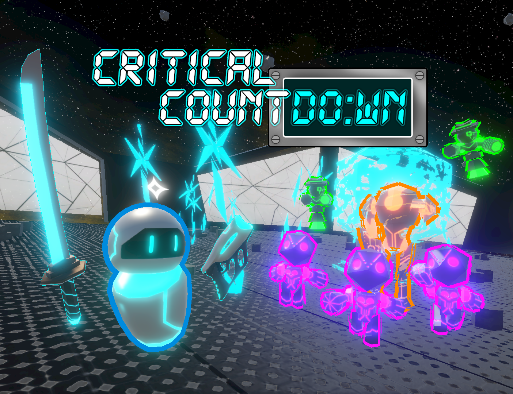

# Critical Countdown

Wave-based top-down shooter game made in 4 days for the GMTK Game Jam 2026

## Links

**Itch:** https://jax-th.itch.io/critical-countdown
**Soundtrack:** https://www.youtube.com/playlist?list=PLFMKF9pc3NWY

## Credits

- Sezylrin [[@Sezylrin](https://github.com/Sezylrin)]: Programming, Weapon Effects 
- Elijah Lowe [[@elijahlowe77](https://github.com/elijahlowe77)]: 3D Modeling, Shaders
- Jaxon Kundrat [[@JaxThom113](https://github.com/JaxThom113)] Programming, UI Design
- Khaleed Kirkland [[@EtheriousPixels](https://github.com/EtheriousPixels)]: 3D Modeling & Texturing 
- DVGS (Dejan Djukic) [[@Djukares](https://github.com/Djukares)]: 2D Art, 3D Modeling 
- Márton Orbán: Music & SFX
